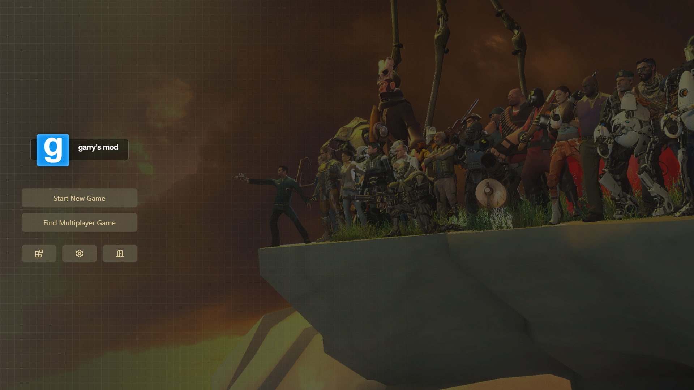
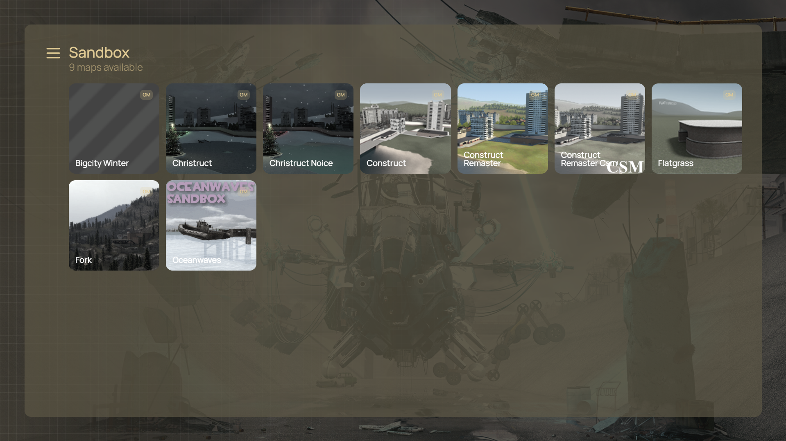
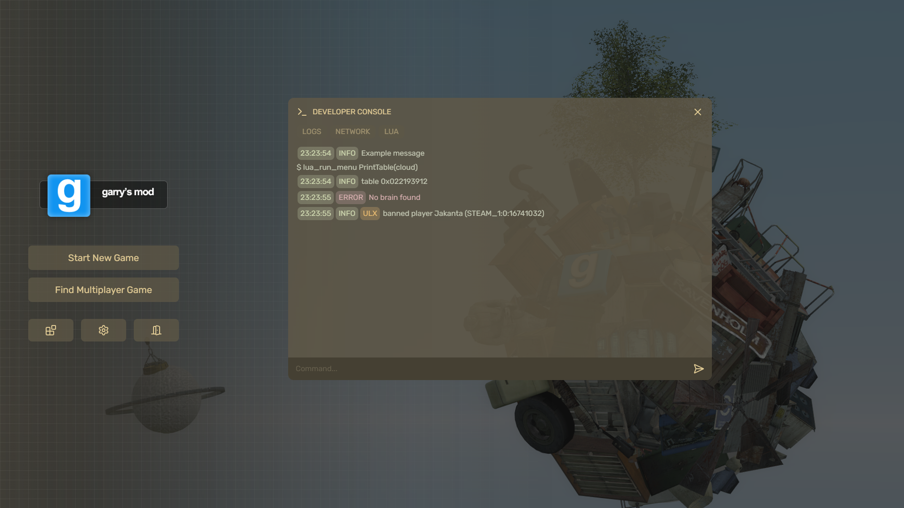

# cloud

cloud is the main menu of Garry's Mod of the new generation

> [!NOTE]
> The project is working in progress. It is not fully usable now.





# Building
```
git clone https://github.com/smokingplaya/cloud
cd cloud

npm install
npm run build
```

## Installing
* After building, copy the contents of ``cloud/dist/`` into ``GarrysMod/garrysmod/html/``.
* Delete ``main.html``
* Rename ``index.html`` to ``main.html``